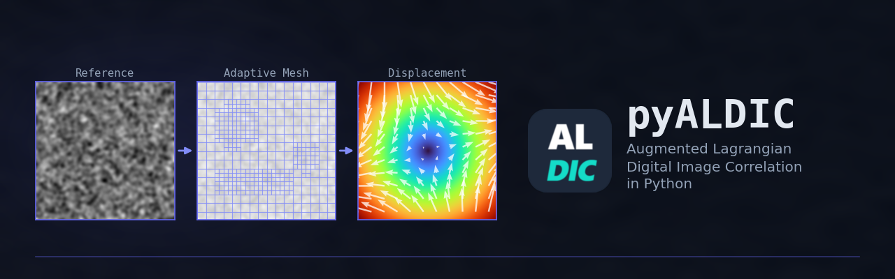
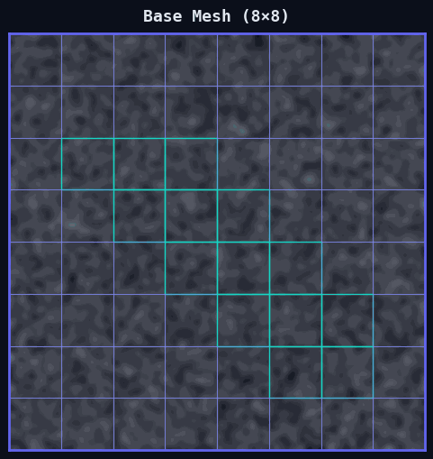
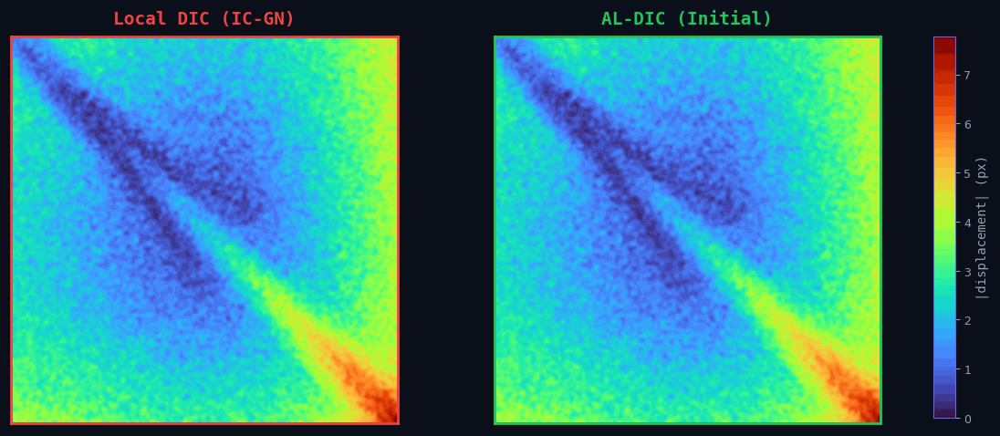
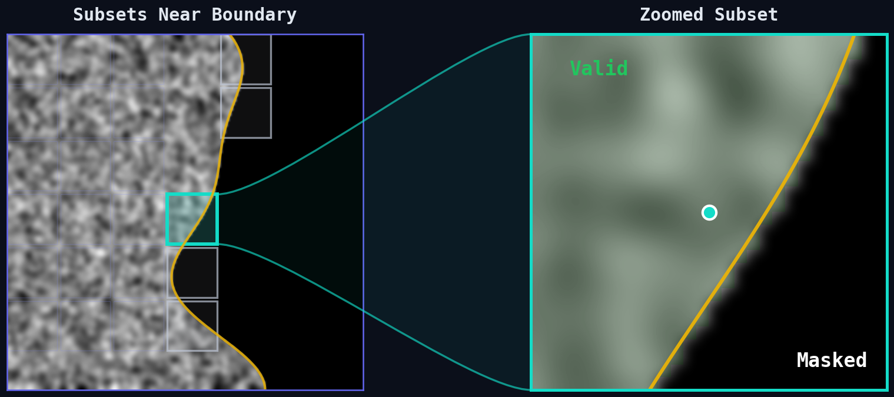
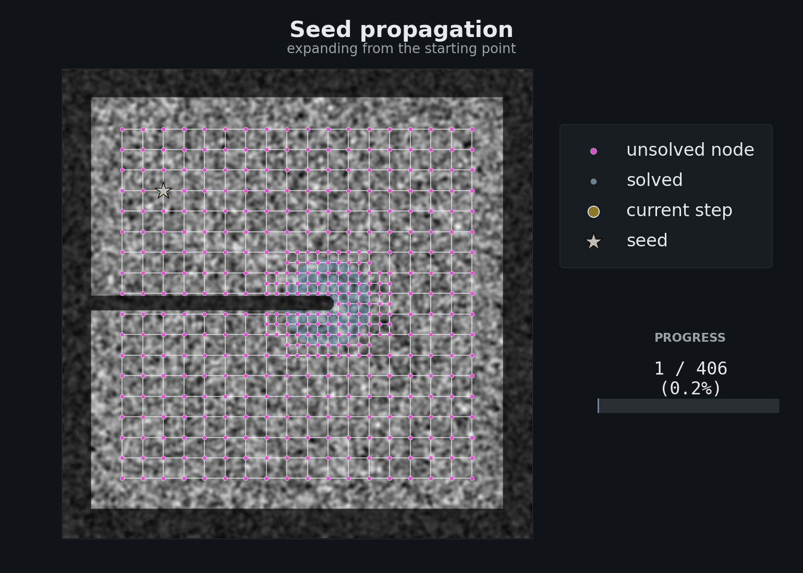

<p align="center">
  
</p>

<p align="center">
  Full-field displacement and strain measurement with adaptive mesh refinement,<br/>
  ADMM global–local optimization, and a built-in desktop GUI.
</p>

<p align="center">
  <a href="https://github.com/zachtong/pyALDIC/actions/workflows/ci.yml"></a>
  
  
  
  <a href="https://doi.org/10.5281/zenodo.19521071"></a>
  <a href="https://pypi.org/project/al-dic/"></a>
</p>

---

## Why pyALDIC?

Standard subset-based DIC (IC-GN) solves each node independently — accurate for small deformations, but struggles with large displacement gradients, discontinuities, and noisy images. pyALDIC uses an **Augmented Lagrangian (ADMM)** framework that couples local IC-GN subproblems with a global FEM regularizer, producing smoother, more accurate fields while maintaining sub-pixel precision.

---

## Key Features

### User-Friendly GUI

A complete desktop application built with PySide6. Three-column layout with image list, ROI tools, and parameter controls on the left — interactive zoom/pan canvas in the center — run controls, field overlay, and console log on the right. Load images, draw ROIs, configure parameters, run DIC, and visualize results — all without writing a single line of code.

<p align="center">
  <!-- TODO: Full-window screenshot of the GUI with data loaded and displacement overlay -->
  <!--  -->
  <i>Desktop GUI — demo coming soon</i>
</p>

### Adaptive Spatial Refinement

Quadtree mesh refinement with 5 built-in criteria: mask boundary, ROI edge, brush region, manual selection, and posterior error. Concentrates computational effort where it matters — near boundaries, discontinuities, and high-gradient regions.

<p align="center">
  
</p>

### Dual Solver: Local DIC + AL-DIC

Run traditional local IC-GN (fast, independent nodes) or full AL-DIC with ADMM global–local coupling (regularized, smoother). Switch between modes with a single parameter — same GUI, same workflow.

<p align="center">
  
</p>

### Dual Tracking Modes

**Accumulative mode** — every frame compared to the first reference (best for small, monotonic deformation). **Incremental mode** — each frame compared to the previous (handles large cumulative deformation with automatic displacement composition and mask warping).

<p align="center">
  <!-- TODO: GIF showing incremental tracking through a multi-frame sequence -->
  <!--  -->
  <i>Accumulative vs incremental tracking — demo coming soon</i>
</p>

### Window Splitting (Masked Subsets)

Near mask boundaries, standard square subsets include invalid pixels. pyALDIC automatically detects partially masked subsets, splits them using connected-component analysis, and solves IC-GN on the valid region only — with Hessian conditioning checks to ensure reliability.

<p align="center">
  
</p>

### Starting Points (Seed Propagation)

For large inter-frame displacement (> 50 px) or discontinuous fields (cracks, shear bands), the default FFT-every-node search becomes slow and error-prone near discontinuities. Select **Starting Points** in the Initial-Guess panel, place one or more points per connected mask region on the canvas (manually or via **Auto-place**), and pyALDIC bootstraps each point with a single-point cross-correlation, then propagates the displacement field along mesh neighbours using F-aware (first-order) extrapolation. On a 512×512 speckle with 100 px rigid translation, this is ~3× faster than FFT with auto-expand, and crucially doesn't pick the wrong side of a crack. Every region must hold at least one point (yellow → green) before the Run button enables.

<p align="center">
  
</p>

### FFT Initial Guess

The classical whole-field initial-guess method is also built in. Each node carries its own FFT cross-correlation against the deformed image, and the peak of the combined cross-power spectrum pins down the rigid-body component in one pass. Choose it when deformation is small-to-moderate and the mesh is dense — one FFT over the whole field is cheaper than per-node searches.

<p align="center">
  
</p>

### Visualization & Export

Full-field displacement and strain overlay with configurable colormaps, alpha blending, and deformed configuration display. Export to MATLAB `.mat`, NumPy `.npz`, CSV, PNG field maps, animated GIF/MP4, and PDF reports.

<p align="center">
  <!-- TODO: Screenshot of the GUI with displacement overlay and export dialog -->
  <!--  -->
  <i>GUI visualization and export — demo coming soon</i>
</p>

---

## Comparison with DIC Tools

|  | **pyALDIC** | **Ncorr** | **DICe** | **VIC-2D** | **MatchID** |
|---|---|---|---|---|---|
| **Algorithm** | ${\color{green}\textsf{ADMM global-local}}$ | Subset (IC-GN) | Subset / Global | Subset (proprietary) | Subset (proprietary) |
| **Regularization** | ${\color{green}\textsf{FEM Q8 global}}$ | — | Tikhonov (global mode) | — | — |
| **Adaptive mesh** | ${\color{green}\textsf{Quadtree (5 criteria)}}$ | — | — | — | — |
| **Mask handling** | ${\color{green}\textsf{Auto warp + split}}$ | Manual | Manual ROI | GUI masks | GUI masks |
| **Multi-frame** | Accum. + Incremental | Accumulative | Both | Both | Both |
| **GUI** | Built-in (PySide6) | MATLAB GUI | CLI + ParaView | Built-in | Built-in |
| **Platform** | ${\color{green}\textsf{Cross-platform}}$ | MATLAB (cross-platform) | Cross-platform | Windows only | Windows only |
| **Export formats** | ${\color{green}\textsf{MAT, NPZ, CSV, PNG, GIF, PDF}}$ | MAT | ExodusII, VTK | Proprietary | CSV, images |
| **Cost** | ${\color{green}\textsf{Free (BSD-3)}}$ | Free (needs MATLAB license) | Free (BSD) | `$5K–50K+` | `$5K–30K+` |
| **Open source** | ${\color{green}\textsf{Yes}}$ | Yes | Yes | No | No |

---

## Accuracy

Sub-pixel accuracy on synthetic speckle images (Lagrangian ground truth):

| Test Case | RMSE |
|-----------|------|
| Rigid translation (2.5 px) | 0.010 px |
| Rotation (2°) | 0.011 px |
| Affine strain (2%) | 0.011 px |

512² images, winsize=32, step=8. The global FEM regularizer (ADMM) enforces kinematic compatibility across neighboring nodes, improving robustness in noisy and high-gradient regions. Accuracy is regression-tested in CI.

## Performance

| Config | Nodes | Solver Time | Throughput | Pipeline FPS† |
|--------|-------|-------------|------------|---------------|
| 256², step=8 | 784 | 0.04 s | ~20,000 POIs/s | ~5 |
| 512², step=8 | 3,600 | 0.17 s | ~22,000 POIs/s | ~1 |
| 512², step=4 | 14,400 | 0.57 s | ~25,000 POIs/s | ~0.2 |
| 1024², step=4 | 61,504 | 2.7 s | ~23,000 POIs/s | ~0.06 |

†**Solver Time** = IC-GN + ADMM (3 iterations), excluding precomputation. **Pipeline FPS** = full per-frame pipeline (FFT init + IC-GN + ADMM), excluding strain. Numba JIT, post-warmup; first run adds ~0.5 s for compilation. **Using Local DIC mode (no ADMM) is ~3× faster.**

---

## Quick Start

### Installation

Three equivalent paths; requires Python >= 3.10.

**From PyPI** (recommended):

```bash
pip install al-dic
```

**From a GitHub Release wheel** (useful behind firewalls, or for
installing a specific past version):

1. Download `al_dic-<version>-py3-none-any.whl` from the
   [releases page](https://github.com/zachtong/pyALDIC/releases).
2. Install locally:

```bash
pip install ./al_dic-<version>-py3-none-any.whl
```

**From source** (editable install with test dependencies):

```bash
git clone https://github.com/zachtong/pyALDIC.git
cd pyALDIC
pip install -e ".[dev]"
```

### Launch GUI

```bash
al-dic
# or
python -m al_dic
```

<details>
<summary><b>Programmatic API</b></summary>

```python
from pathlib import Path
from al_dic.core.config import dicpara_default
from al_dic.core.pipeline import run_aldic
from al_dic.io.io_utils import load_images, load_masks
from al_dic.export.export_npz import export_npz
from al_dic.export.export_mat import export_mat

# Load images and masks
images = load_images("path/to/images", pattern="*.tif")
masks = load_masks("path/to/masks", pattern="*.tif")

# Configure and run
para = dicpara_default(winsize=32, winstepsize=16)
result = run_aldic(para, images, masks, compute_strain=True)

# Access results
for i, fr in enumerate(result.result_disp):
    print(f"Frame {i}: max disp = {abs(fr.U).max():.4f} px")

# Export to .npz and .mat
out = Path("output")
fields = ["disp_u", "disp_v", "strain_exx", "strain_eyy", "strain_exy"]
export_npz(out, "result", "run01", result, fields=fields)
export_mat(out, "result", "run01", result, fields=fields)
```

</details>

---

<details>
<summary><b>Project Structure</b></summary>

```
src/al_dic/
├── core/           Pipeline, config, data structures, frame scheduling
├── gui/            PySide6 GUI application
│   ├── controllers/  Image, ROI, pipeline, visualization controllers
│   ├── dialogs/      Batch import, export dialogs
│   ├── panels/       Canvas area, left/right sidebars
│   └── widgets/      Image list, parameter panel, ROI toolbar, frame nav
├── io/             Image I/O and utilities
├── mesh/           Quadtree mesh generation, refinement criteria
│   └── criteria/   Mask boundary, ROI edge, brush region, manual selection
├── solver/         IC-GN, ADMM (Subpb1/Subpb2), FFT search, FEM assembly
├── strain/         Strain computation, deformation gradient, smoothing
└── utils/          Interpolation, outlier detection, mask warping

tests/              86 test files, 800+ tests
```

</details>

<details>
<summary><b>Testing</b></summary>

```bash
# Run all tests
pytest

# Run with parallel workers
pytest -n auto

# Run specific module
pytest tests/test_solver/test_icgn_solver.py
```

</details>

---

## Citation

If you use pyALDIC in your research, please cite:

```bibtex
@software{tong2026pyaldic_software,
  author = {Tong, Zixiang and Yang, Jin},
  title  = {pyALDIC: Augmented Lagrangian Digital Image Correlation in Python},
  year   = {2026},
  doi    = {10.5281/zenodo.19521071},
  url    = {https://github.com/zachtong/pyALDIC}
}
```

## Contributing

Contributions are welcome! See [CONTRIBUTING.md](CONTRIBUTING.md) for guidelines.

## Acknowledgments

- Based on the [AL-DIC](https://github.com/jyang526843/2D_ALDIC) MATLAB implementation by Dr. Jin Yang
- Developed at **The University of Texas at Austin**

## License

BSD 3-Clause. See [LICENSE](LICENSE) for details.
