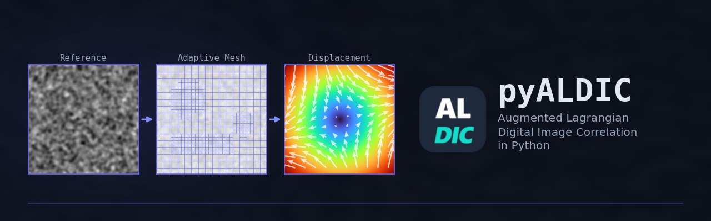
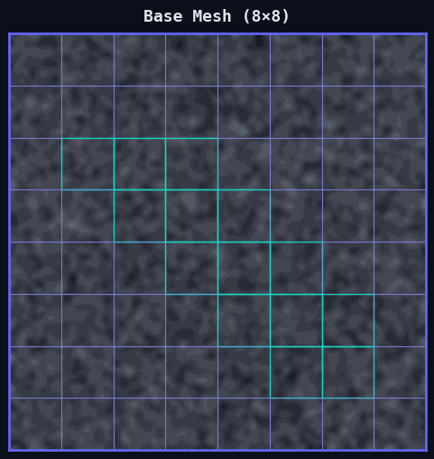
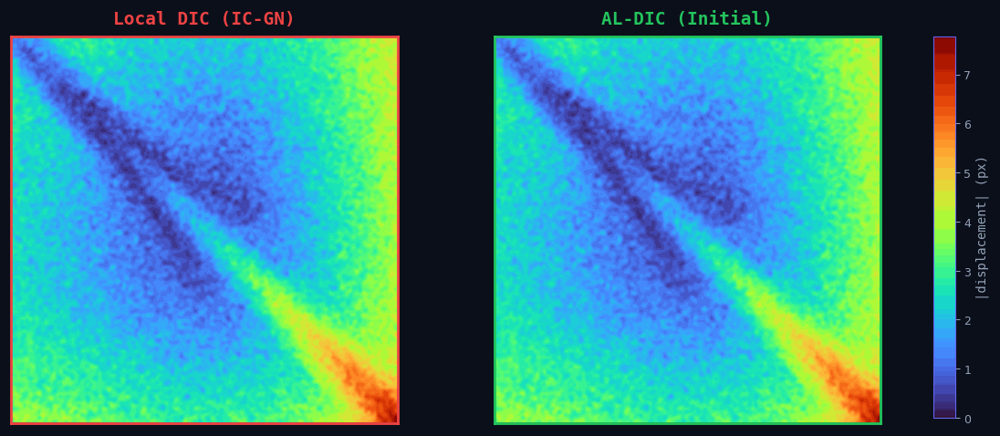
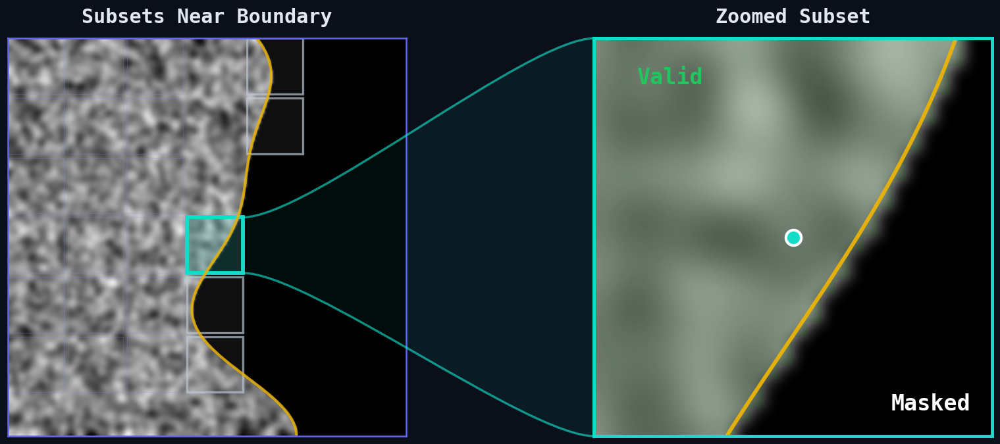
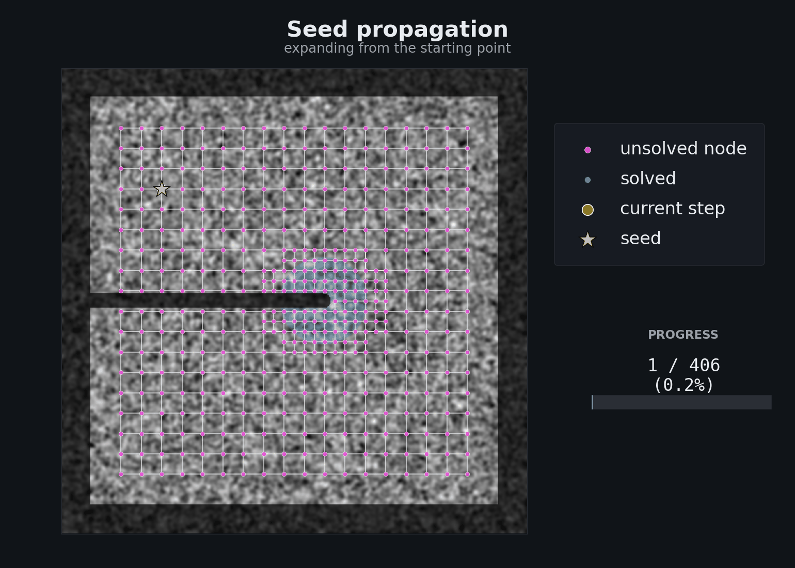

<p align="center">
  
</p>

<p align="center">
  Full-field displacement and strain measurement with adaptive mesh refinement,<br/>
  ADMM global–local optimization, and a built-in desktop GUI.
</p>

<p align="center">
  <a href="https://github.com/zachtong/pyALDIC/actions/workflows/ci.yml"></a>
  
  
  
  <a href="https://arxiv.org/abs/2607.22755"></a>
  <a href="https://doi.org/10.5281/zenodo.19521061"></a>
  <a href="https://pypi.org/project/al-dic/"></a>
</p>

<p align="center">
  <strong>🌍 Now available in 8 languages</strong><br/>
  
  
  
  
  
  
  
  
</p>

---

## Why pyALDIC?

Standard subset-based DIC (IC-GN) solves each node independently — accurate for small deformations, but struggles with large displacement gradients, discontinuities, and noisy images. pyALDIC uses an **Augmented Lagrangian (ADMM)** framework that couples local IC-GN subproblems with a global FEM regularizer, producing smoother, more accurate fields while maintaining sub-pixel precision.

---

## Key Features

### User-Friendly GUI

A complete desktop application built with PySide6. Three-column layout with image list, ROI tools, and parameter controls on the left — interactive zoom/pan canvas in the center — run controls, field overlay, and console log on the right. Load images, draw ROIs, configure parameters, run DIC, and visualize results — all without writing a single line of code.

<p align="center">
  
</p>

<p align="center">
  <i>End-to-end GUI walkthrough — click the <a href="assets/videos/pyALDIC_demo.mp4">full-HD MP4</a> for maximum clarity.</i>
</p>

<p align="center">
  <b>📺 Full video tutorial</b> &nbsp;|&nbsp;
  English: <a href="https://www.youtube.com/watch?v=aLqDyM3tQII">YouTube</a> ·
  <a href="https://www.bilibili.com/video/BV1dBjm6zEnQ?p=2">Bilibili</a>
  &nbsp;&nbsp;·&nbsp;&nbsp;
  中文: <a href="https://www.youtube.com/watch?v=27TtJEMefNA">YouTube</a> ·
  <a href="https://www.bilibili.com/video/BV1dBjm6zEnQ">Bilibili</a>
</p>

<p align="center">
  <b>📘 User manual (PDF)</b> &nbsp;|&nbsp;
  <a href="docs/pyALDIC_v0.8.0_user_guide.pdf">Full user guide</a> ·
  <a href="docs/pyALDIC_v0.8.0_quick_guide.pdf">Quick reference</a>
</p>

### Adaptive Spatial Refinement

Quadtree mesh refinement with 5 built-in criteria: mask boundary, ROI edge, brush region, manual selection, and posterior error. Concentrates computational effort where it matters — near boundaries, discontinuities, and high-gradient regions.

<p align="center">
  
</p>

### Dual Solver: Local DIC + AL-DIC

Run traditional local IC-GN (fast, independent nodes) or full AL-DIC with ADMM global–local coupling (regularized, smoother). Switch between modes with a single parameter — same GUI, same workflow.

<p align="center">
  
</p>

### Dual Tracking Modes

**Accumulative mode** — every frame compared to the first reference (best for small, monotonic deformation). **Incremental mode** — each frame compared to the previous (handles large cumulative deformation with automatic displacement composition and mask warping).

<p align="center">
  <!-- TODO: GIF showing incremental tracking through a multi-frame sequence -->
  <!--  -->
  <i>Accumulative vs incremental tracking — demo coming soon</i>
</p>

### Window Splitting (Masked Subsets)

Near mask boundaries, standard square subsets include invalid pixels. pyALDIC automatically detects partially masked subsets, splits them using connected-component analysis, and solves IC-GN on the valid region only — with Hessian conditioning checks to ensure reliability.

<p align="center">
  
</p>

### Starting Points (Seed Propagation)

For large inter-frame displacement (> 50 px) or discontinuous fields (cracks, shear bands), the default FFT-every-node search becomes slow and error-prone near discontinuities. Select **Starting Points** in the Initial-Guess panel, place one or more points per connected mask region on the canvas (manually or via **Auto-place**), and pyALDIC bootstraps each point with a single-point cross-correlation, then propagates the displacement field along mesh neighbours using F-aware (first-order) extrapolation. On a 512×512 speckle with 100 px rigid translation, this is ~3× faster than FFT with auto-expand, and crucially doesn't pick the wrong side of a crack. Every region must hold at least one point (yellow → green) before the Run button enables.

<p align="center">
  
</p>

### FFT Initial Guess

The classical whole-field initial-guess method is also built in. Each node carries its own FFT cross-correlation against the deformed image, and the peak of the combined cross-power spectrum pins down the rigid-body component in one pass. Choose it when deformation is small-to-moderate and the mesh is dense — one FFT over the whole field is cheaper than per-node searches.

<p align="center">
  
</p>

### Visualization & Export

Full-field displacement and strain overlay with configurable colormaps, alpha blending, and deformed configuration display. Export to MATLAB `.mat`, NumPy `.npz`, CSV, JPEG/PNG/TIFF field maps, animated GIF/MP4, and PDF reports — with a selectable output resolution and quality so large batches stay small and fast. A WYSIWYG **Preview & Colorbar** tab previews frames through the real export path and styles the colorbar (position, font, thickness, background, margin), and GIF/MP4 animations encode frame-by-frame — with optional frame-step decimation — so long sequences export without a RAM spike.

<p align="center">
  <!-- TODO: Screenshot of the GUI with displacement overlay and export dialog -->
  <!--  -->
  <i>GUI visualization and export — demo coming soon</i>
</p>

### Save & Resume Sessions

Save a whole project to a single `.aldic` file — the image list, ROIs, parameters, the current view, **and the computed displacement/strain results** — then reopen it later to land back exactly where you left off, without recomputing (source images are re-linked from their original folder). Double-click a `.aldic` file (after a one-click Windows file association) or pass it on the command line to launch straight into that session.

---

## Comparison with DIC Tools

|  | **pyALDIC** | **Ncorr** | **DICe** | **VIC-2D** | **MatchID** |
|---|---|---|---|---|---|
| **Formulation** | <mark>**Hybrid local + global (ALDIC)**</mark> | Local (subset) | Local (subset) | Local (subset) | Local (subset) |
| **Grid** | <mark>**Adaptive refined grid**</mark> | Uniform grid | Uniform grid | Uniform grid | Uniform grid |
| **GUI** | <mark>**Built-in desktop**</mark> | Built-in desktop¹ | Built-in desktop | Built-in desktop | Built-in desktop |
| **Platform** | <mark>**Windows, macOS, Linux**</mark> | Windows, macOS, Linux¹ | Windows, macOS, Linux | Windows only | Windows only |
| **Latest release**² | <mark>**v0.8.0 (2026)**</mark> | v1.2.2 (2017) | v3.0-beta (2023) | VIC-2D 7 (2022) | MatchID 2D (2026) |
| **Cost** | <mark>**Free**</mark> | Free¹ | Free | Commercial | Commercial |

<sub>¹ Requires a MATLAB license.</sub><br/>
<sub>² Compiled from public web sources and may be inaccurate. Last verified: 2026-04-20.</sub>

---

## Accuracy

pyALDIC implements the Augmented Lagrangian DIC (AL-DIC) method. Quantitative accuracy, convergence, and noise-robustness characterization — including synthetic-speckle ground-truth studies and comparisons against classical subset-based DIC — are reported in the peer-reviewed literature:

- **Yang, J. & Bhattacharya, K.** *Augmented Lagrangian Digital Image Correlation.* **Experimental Mechanics** 59, 187–205 (2019). [doi:10.1007/s11340-018-00457-0](https://doi.org/10.1007/s11340-018-00457-0)  _— original AL-DIC paper, 145+ citations._

- **Tong, Z. et al.** *3D Stereo Adaptive Mesh Augmented Lagrangian Digital Image Correlation.* **Experimental Mechanics** (2025). [doi:10.1007/s11340-025-01225-7](https://doi.org/10.1007/s11340-025-01225-7)  _— 3D stereo extension of the AL-DIC framework._

The software itself — its architecture, the adaptive quadtree meshing and
mask-aware subset splitting, and verification against synthetic displacement
fields, rigid-body motion, Mode-I cracking and experimental uniaxial tension —
is described in the pyALDIC paper (preprint, under review):

- **Tong, Z. & Yang, J.** *pyALDIC: A Python Implementation of Augmented Lagrangian Digital Image Correlation with a GUI, Adaptive Meshing, and Mask-Aware Subset Splitting.* **arXiv:2607.22755** (2026). [arxiv.org/abs/2607.22755](https://arxiv.org/abs/2607.22755)

The AL-DIC method was also independently evaluated in the community benchmark **DIC Challenge 2.0** — *Reu et al., "DIC Challenge 2.0: developing images and guidelines for evaluating accuracy and resolution of 2D analyses: focus on the metrological efficiency indicator", Experimental Mechanics*. [doi:10.1007/s11340-021-00806-6](https://doi.org/10.1007/s11340-021-00806-6)

## Performance

| Config | Nodes | Solver Time | Throughput | Pipeline FPS† |
|--------|-------|-------------|------------|---------------|
| 256², step=8 | 784 | 0.04 s | ~20,000 POIs/s | ~5 |
| 512², step=8 | 3,600 | 0.17 s | ~22,000 POIs/s | ~1 |
| 512², step=4 | 14,400 | 0.57 s | ~25,000 POIs/s | ~0.2 |
| 1024², step=4 | 61,504 | 2.7 s | ~23,000 POIs/s | ~0.06 |

†**Solver Time** = IC-GN + ADMM (3 iterations), excluding precomputation. **Pipeline FPS** = full per-frame pipeline (FFT init + IC-GN + ADMM), excluding strain. Numba JIT, post-warmup; first run adds ~0.5 s for compilation. **Using Local DIC mode (no ADMM) is ~3× faster.**

**Memory.** Peak RAM at 4096² × 3 frames is ~12 GB (down from 37 GB in v0.4.x). Since v0.6.0, frames stream from disk on demand instead of being pre-loaded as full-sequence stacks (~40 GB less RAM at the start of a 300-frame 4K run), and incremental-mode caches are LRU-bounded, so memory stays flat over long sequences. A chunked NCC search bounds the working buffer at ~4 GB per chunk, preventing out-of-memory failures at large search ranges; tested up to 5472 × 3648 with search range = 350 px.

---

## Quick Start

### Installation

**On Windows, with no Python?** Download the bundle — unzip and double-click.
**On macOS or Linux,** or anywhere you want the Python API, install from PyPI.

#### Windows: the standalone bundle

Nothing to install, no administrator rights, no interpreter.

1. Download `pyALDIC-<version>-win64.zip` from the
   [releases page](https://github.com/zachtong/pyALDIC/releases/latest).
2. Unzip it anywhere you can write — your Desktop or Documents folder is fine.
3. Open the folder and run `pyALDIC.exe`.

Windows 10 (1703 or later) and Windows 11, 64-bit. Roughly 500 MB unzipped.
The bundle is not code-signed, so SmartScreen shows a "Windows protected your
PC" notice on first launch: choose **More info → Run anyway**. Keep the folder
together — the executable needs the files beside it.

The first analysis after unzipping takes noticeably longer than the rest while
the compute kernels compile; pyALDIC starts that in the background as soon as
it opens, and caches the result, so it happens once per installation. If
something goes wrong there is a log at
`%LOCALAPPDATA%\pyALDIC\logs\pyALDIC.log`, and `pyALDIC-console.exe` in the
same folder runs the identical application with a console window attached.

#### macOS, Linux, and anyone who has Python

There is no macOS or Linux bundle yet — packaging one for macOS means working
through Apple's notarization, which is a separate piece of work. Installing
from PyPI takes one command and gets you the identical application:

```bash
pip install al-dic
al-dic
```

If you do not maintain Python environments, `pipx` is the friendlier route: it
creates an isolated environment for pyALDIC so its dependencies cannot collide
with anything else you have installed.

```bash
pipx install al-dic     # brew install pipx, if you do not have it
al-dic
```

Requires Python >= 3.10. Both are also how you get the programmatic API
documented further down.

#### Other install paths

**From a GitHub Release wheel** (useful behind firewalls, or for
installing a specific past version):

1. Download `al_dic-<version>-py3-none-any.whl` from the
   [releases page](https://github.com/zachtong/pyALDIC/releases).
2. Install locally:

```bash
pip install ./al_dic-<version>-py3-none-any.whl
```

**From source** (editable install with test dependencies):

```bash
git clone https://github.com/zachtong/pyALDIC.git
cd pyALDIC
pip install -e ".[dev]"
```

### Launch GUI

```bash
al-dic
# or
python -m al_dic
```

### Try it on the included examples

Three short real-experiment sequences ship with the repository, under
[`examples/quickstart/`](examples/quickstart/) — uniaxial tension, tension
around holes, and a rigid-body rotation. Each folder holds a reference frame and
four loaded frames, and
[its README](examples/quickstart/README.md) gives the subset size, step and
solver settings to start from for each one.

Nothing else needs downloading: those images are complete as they stand.

To drive pyALDIC from Python instead — batch-processing many samples from one
config file, or replotting exported results without repeating the correlation —
see [`examples/scripting/`](examples/scripting/).

<details>
<summary><b>Programmatic API</b></summary>

```python
from pathlib import Path
import numpy as np
from al_dic.core.config import dicpara_default
from al_dic.core.data_structures import GridxyROIRange
from al_dic.core.pipeline import run_aldic
from al_dic.io.io_utils import load_images, load_masks
from al_dic.export.export_npz import export_npz
from al_dic.export.export_mat import export_mat

# Load images and masks
images = load_images("path/to/images", pattern="*.tif")
masks = load_masks("path/to/masks", pattern="*.tif")

# Configure and run.  gridxy_roi_range is REQUIRED: it is the pixel box to
# correlate, and it defaults to a zero-size box (the GUI fills it in from the
# ROI you draw).  Here it is taken from the mask's bounding box.
ys, xs = np.where(masks[0])
para = dicpara_default(
    winsize=32,
    winstepsize=16,          # must be a power of 2
    use_masks=True,
    gridxy_roi_range=GridxyROIRange(
        gridx=(int(xs.min()), int(xs.max())),
        gridy=(int(ys.min()), int(ys.max())),
    ),
)
result = run_aldic(para, images, masks, compute_strain=True)

# Access results
for i, fr in enumerate(result.result_disp):
    print(f"Frame {i}: max disp = {abs(fr.U).max():.4f} px")

# Export to .npz and .mat
out = Path("output")
fields = ["disp_u", "disp_v", "strain_exx", "strain_eyy", "strain_exy"]
export_npz(out, "result", "run01", result, fields=fields)
export_mat(out, "result", "run01", result, fields=fields)
```

</details>

---

<details>
<summary><b>Project Structure</b></summary>

```
src/al_dic/
├── core/           Pipeline, config, data structures, frame scheduling
├── gui/            PySide6 GUI application
│   ├── controllers/  Image, ROI, pipeline, visualization controllers
│   ├── dialogs/      Batch import, export dialogs
│   ├── panels/       Canvas area, left/right sidebars
│   └── widgets/      Image list, parameter panel, ROI toolbar, frame nav
├── io/             Image I/O and utilities
├── mesh/           Quadtree mesh generation, refinement criteria
│   └── criteria/   Mask boundary, ROI edge, brush region, manual selection
├── solver/         IC-GN, ADMM (Subpb1/Subpb2), FFT search, FEM assembly
├── strain/         Strain computation, deformation gradient, smoothing
└── utils/          Interpolation, outlier detection, mask warping

tests/              128 test files, 1500+ tests
```

</details>

<details>
<summary><b>Testing</b></summary>

```bash
# Run all tests
pytest

# Run with parallel workers
pytest -n auto

# Run specific module
pytest tests/test_solver/test_icgn_solver.py
```

</details>

---

## About the Authors

pyALDIC is developed in [Dr. Jin Yang's group](https://sites.utexas.edu/jyang/) at **The University of Texas at Austin**.

Beyond pyALDIC itself, the authors have contributed to community-wide DIC standards:

- **Jin Yang** — co-editor of *A Good Practices Guide for Digital Image Correlation*, **1st edition** (2018) and **2nd edition** (2025), published by the International Digital Image Correlation Society (iDICs).
- **Zixiang Tong** — co-editor of *A Good Practices Guide for Digital Image Correlation*, **2nd edition** (2025).

---

## Community

Come say hi — questions, bug reports, feature ideas, and general discussion are all welcome.

### 💬 Async forum (English + 中文)

[**GitHub Discussions**](https://github.com/zachtong/pyALDIC/discussions) — the long-form, searchable Q&A home for pyALDIC.

- [Q&A](https://github.com/zachtong/pyALDIC/discussions/categories/q-a) — how do I use pyALDIC for X?
- [Ideas](https://github.com/zachtong/pyALDIC/discussions/categories/ideas) — feature proposals and design talk
- [Show and tell](https://github.com/zachtong/pyALDIC/discussions/categories/show-and-tell) — share your experiments and figures
- [Announcements](https://github.com/zachtong/pyALDIC/discussions/categories/announcements) — release notes and news

Both **English** and **中文** posts are welcome; please tag Chinese posts with `[中文]` in the title for easy filtering.

### ⚡ Real-time chat

| Audience | Platform | Join |
|---|---|---|
| 🌍 International | Discord | [**discord.gg/Uh9RXvZt6n**](https://discord.gg/Uh9RXvZt6n) |
| 🇨🇳 中文用户 | QQ 群 | 群号 `1061177356` |

### 🐛 Bug reports

[**GitHub Issues**](https://github.com/zachtong/pyALDIC/issues/new/choose) — use the bug-report template. Usage questions should go to Discussions, not Issues.

### 📧 Private consulting

For research collaboration, confidential data, or one-on-one consulting: **zachtong@utexas.edu**.

---

## Citation

If you use pyALDIC in your research, please cite the software paper:

```bibtex
@article{tong2026pyaldic,
  author  = {Tong, Zixiang and Yang, Jin},
  title   = {pyALDIC: A Python Implementation of Augmented Lagrangian Digital
             Image Correlation with a GUI, Adaptive Meshing, and Mask-Aware
             Subset Splitting},
  journal = {arXiv preprint arXiv:2607.22755},
  year    = {2026},
  doi     = {10.48550/arXiv.2607.22755},
  url     = {https://arxiv.org/abs/2607.22755}
}
```

To cite a specific version of the code as well:

```bibtex
@software{tong2026pyaldic_software,
  author = {Tong, Zixiang and Yang, Jin},
  title  = {pyALDIC: Augmented Lagrangian Digital Image Correlation in Python},
  year   = {2026},
  doi    = {10.5281/zenodo.19521071},
  url    = {https://github.com/zachtong/pyALDIC}
}
```

## Contributing

Contributions are welcome! See [CONTRIBUTING.md](CONTRIBUTING.md) for guidelines.

## Acknowledgments

- Based on the [AL-DIC](https://github.com/jyang526843/2D_ALDIC) MATLAB implementation by Dr. Jin Yang
- Developed at **The University of Texas at Austin**

## License

BSD 3-Clause. See [LICENSE](LICENSE) for details.
